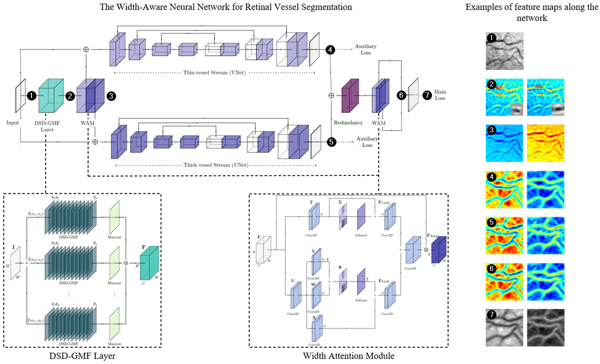

# WA-Net (Retinal Vessel Segmentation)
PyTorch implementation of WA-Net, based on preprint paper "Width Attention based Convolutional Neural Network for Retinal Vessel Segmentation" (submitted to the journal "Expert Systems with Applications" on October, 25th)



## Abstract

The analysis of the vascular tree is a fundamental part of the clinical assessment of retinal images. The diversity of blood vessel calibers and curvatures, as well as the ocular vascular alterations derived from the progress of certain diseases, make automatic blood vessel segmentation a challenging task. In this paper, a novel Width Attention-based Convolutional Neural Network, called WA-Net, is proposed. 
In the WA-Net, a fundus image is decomposed into multiple channels by a layer of Distorted Second-Order Differential Gaussian Match Filters (DSD-GMF), where each channel is associated with a vessel width. Subsequently, the channel relevance is weighted through the Width Attention Module (WAM), which considers both channel and position correlations. Finally, in order to specialize the feature maps with a concrete vessel-width category, either thin-vessel or thick-vessel related, the weighted channels are divided into two groups by the Two-Stream Block, composed of three-level UNet streams.
Experimental results on three public datasets (DRIVE/STARE/CHASE) indicate that the proposed method provides a performance gain over other attention-based and non-attention-based architectures, achieving state-of-the-art Accuracy and Area-Under-the-Receiver-Operating-Characteristic-Curve scores (0.9575/0.9665/9653 and 0.9784/0.9865/0.9841 within the Field-of-View, respectively). 

## Prerequisities
The neural network is developed with the Pytorch and Kornia libraries, we refer to [Pytorch website](https://pytorch.org/) and [Kornia Repository](https://github.com/kornia/kornia) for the installation.
This code has been tested with kornia 0.6.1, pytorch 1.7.0, torchvision 0.8.1 and CUDA 10.2. See the Pytorch documentation for more details.

The following dependencies are needed:
- pytorch >=1.7.0
- torchvision >= 0.8.1
- kornia > = 0.6.1
- numpy >= 1.18.1
- Pillow >=7.0.0
- opencv >= 4.2.0
- scikit-learn >= 0.22.1

See requirements.txt for more details.

Additionally, the [DRIVE](https://drive.grand-challenge.org/) dataset is needed.  We are not allowed to provide the dataset here, but it can be freely downloaded from the official website by joining the challenge. 
The images should be included in the path "./datasets/DRIVE". This folder should have the following structure:

```
DRIVE
│
└───test
|    ├───1st_manual
|    └───2nd_manual
|    └───images
|    └───mask
│
└───training
    ├───1st_manual
    └───images
    └───mask
```

This structure can be modified in the file "./trainer/dataset_config_file.py".

## Training

The model can be trained with:

```
python main_train.py 
python main_train.py -c config.txt
python main_train.py --param param_value
```

Execute "main_train.py -h" for more information on available parameters. First option use default parameter values, which can be modified in the file "./utils/settings.py", second option overrides default parameters with the specified in a configfile. Third option overrides default and configfile values. 

If available, a GPU will be used. The following files will be saved in the folder "exp1" :
- best model weights (model_best.pth.tar)
- last model weights (model_checkpoint.pth.tar)

# Test

The model can be evaluated agains the test images from DRIVE with:

```
python main_eval.py
python main_eval.py -c config.txt
python main_eval.py --param param_value
```
Execute "main_eval.py -h" for more information on available parameters. First option use default parameter values, which can be modified in the file "./utils/settings.py", second option overrides default parameters with the specified in a configfile. Third option overrides default and configfile values. 

If available, a GPU will be used. The following files will be saved in the folder "exp1" :
- predictions (all_predictions.png)
- groundtruths (all_groundtruths.png)
- FoV masks (all_fovs.png)

